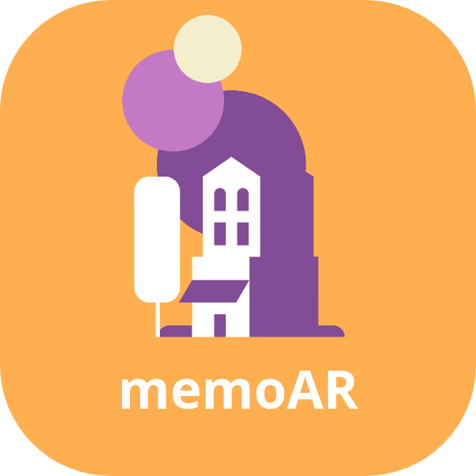

# memoAR

## What is the memoAR? 

memoAR represents the new Era of leaving feedbacks. By taking advantage of Augmented Reality, users can now use memoAR to leave feedback in the real world.

## Features implemented in the MVP

* Leave feedback (in the form of a sphere) with your camera in augmented reality
* share a common session with up to 4 people
* being able to see what other people in the same session are posting in AR
 
## Technologies used
* Swift
* ARKit
